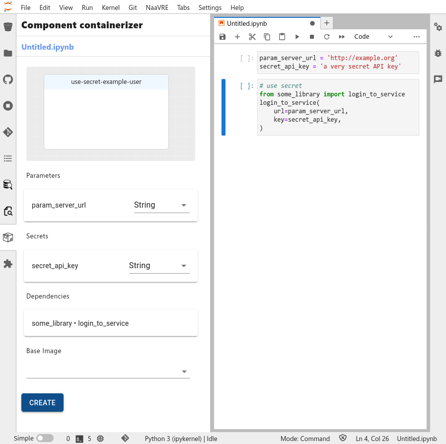

# The NaaVRE Interface

The Notebook as a Virtual Research Environment (NaaVRE) is a set of tools to allow users to containerize cells, compose
workflows and execute them on a workflow engine.


## Component Containerizer


The 'Cell Preview' panel shows a preview of the cell that is currently selected including its name, inputs and outputs.
Under the 'Cell Preview' panel there a list of the inputs and outputs of the cell and their types. The types are needed
to be filled in by the user when containerizing a cell. Currently, the supported types are:
* String
* Integer
* Float
* List

Under the 'Inputs' and 'Outputs' there is the 'Base Image' selection. This is the base image that will be used to build
the container. The default base image is 'miniconda3'. The user can select a different base image from the drop down.


### Special Variables

Special variables can be used in the cell code. Their name should contain one of the following prefixes:

* `param_`: these variables are used to pass input parameters to a cell. They should be used to allow users to set their own values when running a workflow. When containerizing the cell, a default value is extracted from the code and saved to the catalogue. When running a workflow that contains the cell, users use the default value or set a custom one. The value is then passed to the cell during execution.

  [Param_example.webm](https://github.com/QCDIS/vre_documetation/assets/9680609/fea3d96b-97d3-43cd-b009-b5bd4537de5a)

* `secret_`: these variables are used to pass secret parameters to a cell. They should be used for credentials such as passwords or API keys. They are similar to `param_` variables, but no default value is saved to the catalogue, and values are handled in a secure way when executing the workflow.

  

* `conf_`: these variables are used to pass configuration parameters to all cells. They are visible by all cells of the notebook. They can be thought of as 'global' variables therefore, they do not require to set their type  like other variables. Their value is set when containerizing the cell, and cannot be updated when running the workflow.

  [Conf_example.webm](https://github.com/QCDIS/vre_documetation/assets/9680609/f7020f7f-69d9-4916-bb56-83ed64cb98a8)

  

Notice in the image above that the `conf_b` variable is declared in the first cell and used in the second and third cell.
However, the `conf_b` is not showing up as input in the second and third cell.

### Overriding definition of cell inputs and outputs

:::warning
This feature can result in broken containerized cells. Use it with caution.
:::

In normal circumstances, the component containerizer automatically determines the cell variables (inputs, outputs,
params, confs) and dependencies by analyzing the source code.

This can be overridden by adding a special comment to the cell. The comment contains a YAML document, beginning with
`---` and ending with `...`.

Example:

```
# My cell name
# ---
# NaaVRE:
#  cell:
#   inputs:
#    - my_input: String
#    - my_other_input: Integer
#   outputs:
#    - my_output: List
#    - my_other_output: List
#   params:
#    - param_something:
#       type: String
#       default_value: "my default value"
#   confs:
#    - conf_something_else:
#       assignation: "conf_something_else = 'my other value'"
#   dependencies:
#    - name: yaml
#    - name: numpy
#      asname: np
#    - name: signal
#      module: scipy
# ...

(my cell code)
```

If an entry (e.g. `params:`) is omitted from the comment, the containerizer will try to determine the appropriate values from the source code.
This makes it possible to override some variable types, while using the code analysis for others.
In this example, the input and output are manually specified, while the dependencies, confs and params are determined from the source code (note how we specify that the cell has no outputs):

```
# My cell with partial override
# ---
# NaaVRE:
#  cell:
#   inputs:
#    - my_input: String
#   outputs: []
# ...

print(my_input, param_my_param)
```

For the full syntax, see the [YAML document schema](https://github.com/QCDIS/NaaVRE/blob/main/jupyterlab_vre/services/extractor/cell_header.schema.json).

### Containerizing R cells

While containerizing R code cells is similar to Python, R's characteristics make it more challenging and require additional steps. The type of detected variables will only be identified if they have been explicitly assigned a primitive value.

```
# Will be detected
a <- 1L # Integer
b <- 1.5 # Float
c <- "foo" # String
d <- list(1,2,3) # List

# Will not be detected
e <- round(1.555, 2)
```

The type detector can detect the type of variables that have not been explicitly assigned a primitive value.


By pressing the `Type Detector` button, the selected cell will be executed by the kernel and the types of the detected variables will be retrieved. However, this does require that the selected cell is executable and that all used variables are initialized.


In R, new variables can be added to the environment without explicit initialization, leading to instances where additional inputs are detected. This is especially common when working with dataframes, where variables for columns may be implicitly created. Unwanted input variables can be removed by pressing the `X` button next to the variable.

## Experiment Manager

In the 'Experiment Manager' page you can compose and execute workflows. To compose a workflow click on the '+' button in
the bottom right corner of the page and select the 'Cells Catalog' option.


After you have selected the cells you want to compose a workflow with, click on the 'Add to Workspace' button.

### Special Components

In the 'Experiment Manager' page you can compose workflows using special components. These components are:
* Splitter: This component is used to split an output array from a call into its elements and feed each element to the
  next cell. That way the next cell will be executed in parallel as many times as the number of elements in the array.
* Merger: This component is used to merge the outputs of multiple cells into a single array.

### Cells Catalog
The cells catalog contains all the cells that have been containerized.


### Re-containerizing cells used in a workflow

When re-containerizing a cell used in a workflow, you might need to update the
workflow itself:


- If you only updated the cell's source code or dependencies: the workflow automatically uses the new version of the
  cell.
- If you changed the cell’s inputs, outputs or parameters: the workflow needs to be updated. Remove the cell from the
  workflow, and add the new version from the catalogue.
- If you changed the cell’s title: a new cell is created in the catalogue. Both the old and new cell can be used.
  Workflows using the old cell don’t need to be updated.

### Managing files in workflows

To transfer files between containerized cells when running the workflow, they need to be placed in the `/tmp/data/` repository. Files outside of this repository are not preserved from one containerized cell to the other.

The best practice for exchanging files between cells is to save the file in `/tmp/data/`, and pass the filename between the cells. Example:

```python
# Write file
filename = '/tmp/data/my_file.csv'
with open(filename, 'w') as f:
    f.write('file content')
```

```python
# Read file
with open(filename, 'r') as f:
    data = f.read()
```


## Notebook Search

In the 'Notebook Search' page you can search for notebooks relevant to your research. To search for notebooks click on
the icon in the middle left of the page. There you can search for notebooks.


The results will be displayed in the left panel. If you clik on a result you will be shown some relevant information
such its title, link, summary etc. If you click on the 'More' button you will be redirected to the notebook where you
can download it.


## Jupyterlab-git

In all VLs there is a Git integration with jupyterlab-git.
To clone and push to a repository you can follow the instructions from here: [jupyterlab-git](https://pypi.org/project/jupyterlab-git/).
