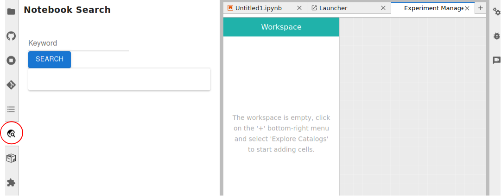
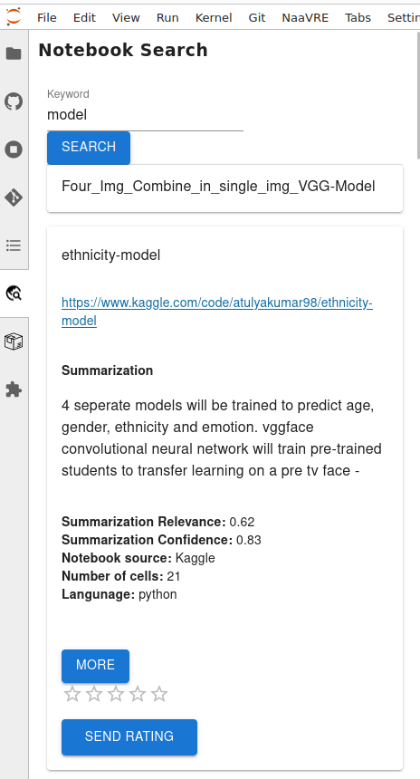
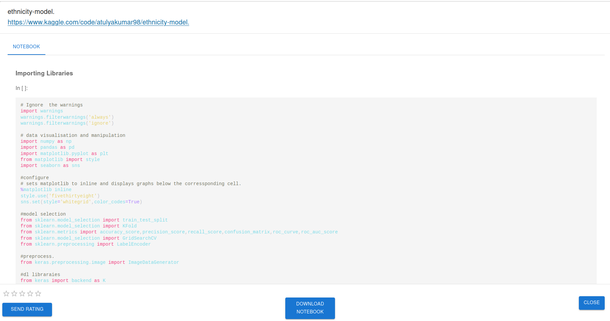

# NaaVRE Documentation

The Notebook as a Virtual Research Environment (NaaVRE) is a set of tools to allow users to containerize cells, compose
workflows and execute them on a workflow engine.

## Notebook Search

In the 'Notebook Search' page you can search for notebooks relevant to your research. To search for notebooks click on
the icon in the middle left of the page. There you can search for notebooks.

The results will be displayed in the left panel. If you clik on a result you will be shown some relevant information
such its title, link, summary etc. If you click on the 'More' button you will be redirected to the notebook where you
can download it.

