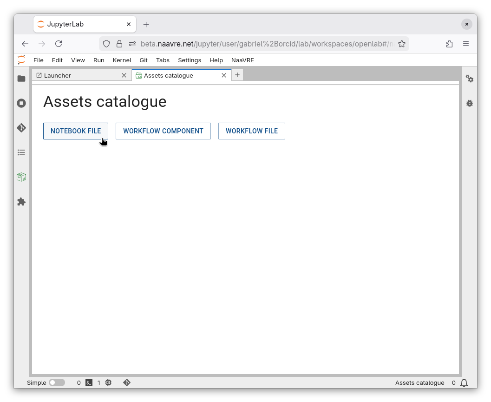
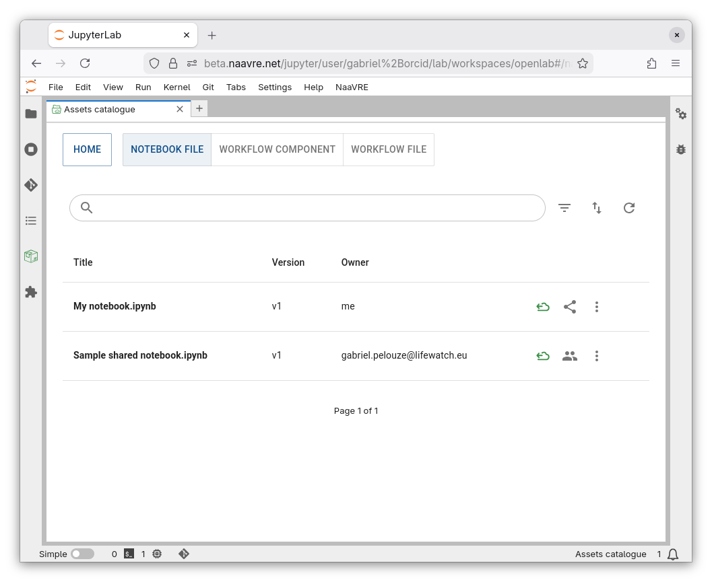
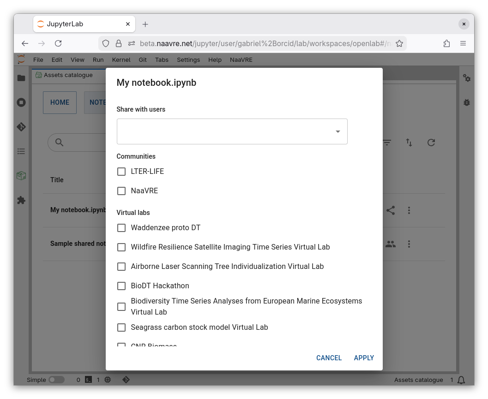
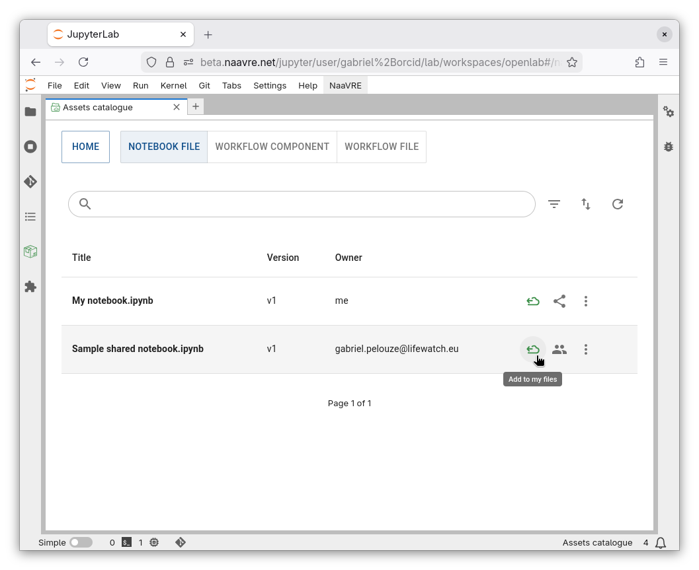
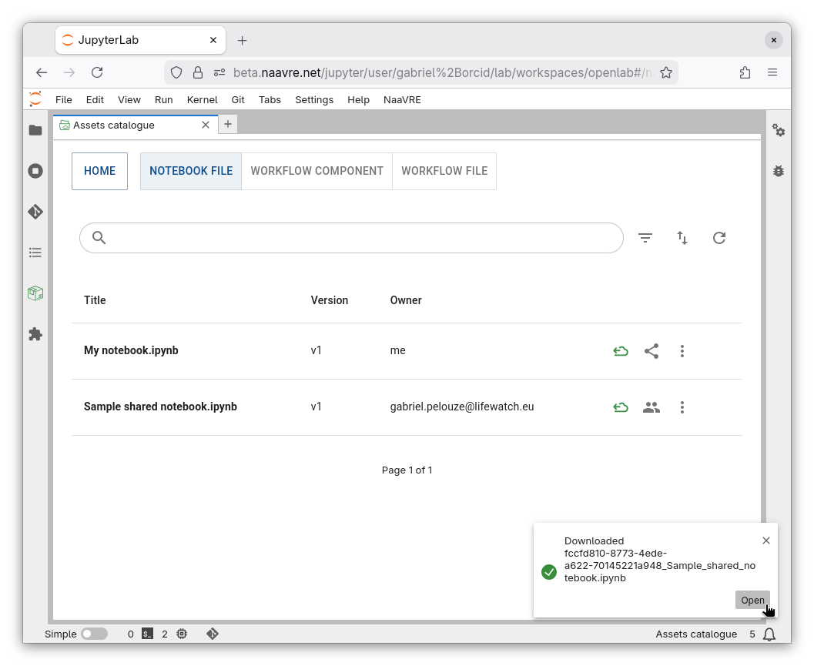
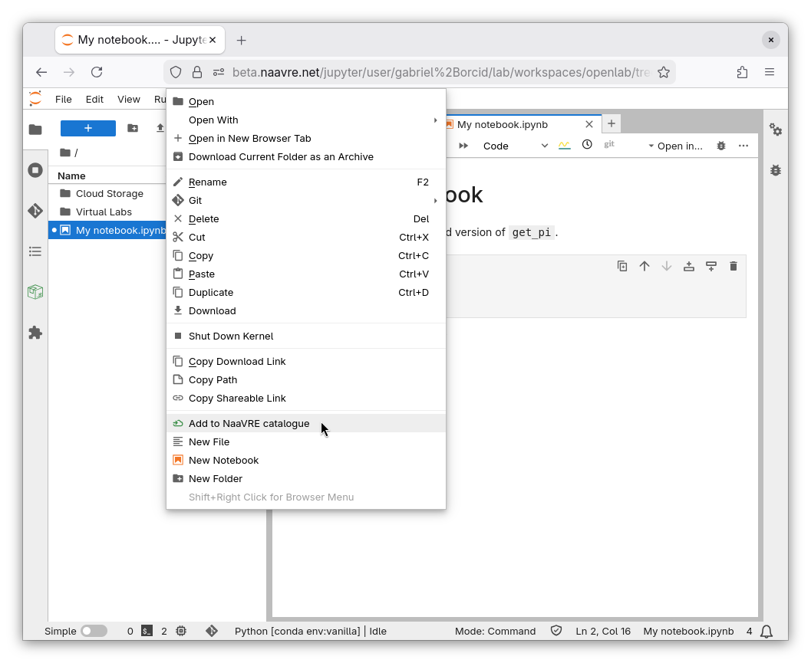
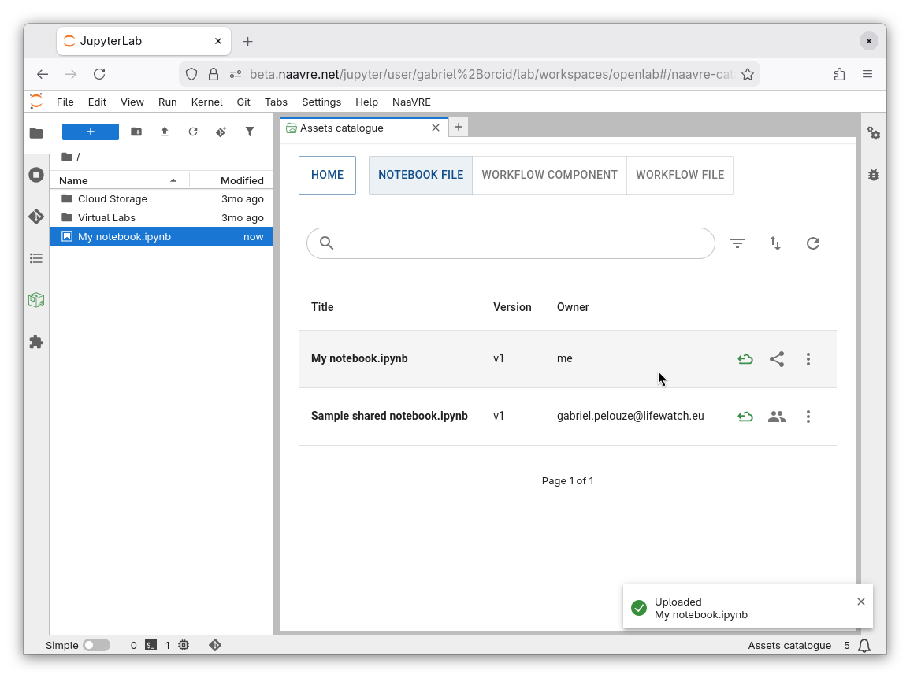
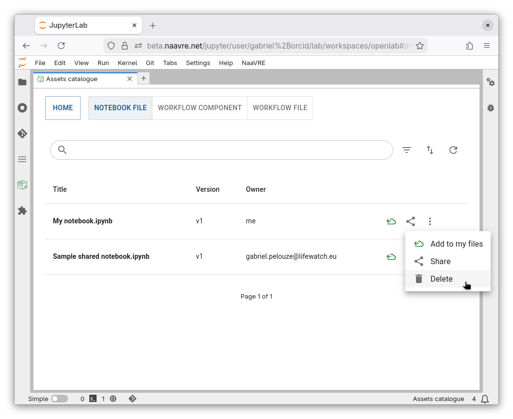

# Assets Catalogue

import DeleteIcon from '@mui/icons-material/Delete';
import FilterListIcon from '@mui/icons-material/FilterList';
import PeopleIcon from '@mui/icons-material/People';
import RefreshIcon from '@mui/icons-material/Refresh';
import ShareIcon from '@mui/icons-material/Share';
import AddFileToCatIcon from '@site/src/components/icons/AddFileToCatIcon';
import GetFileFromCatIcon from '@site/src/components/icons/GetFileFromCatIcon';

You can use the assets catalogue to share notebook files, workflow components, and workflow files.
Assets can be shared directly with another user, with a virtual lab, or with a community.

## Discovering assets

Start by selecting the kind of asset that you to explore.

You can see the available assets.

By default, assets are displayed if they are either:
- owned by you,
- shared directly with you,
- shared with the current virtual lab or communities.

You can display other assets (e.g. ones shared with other labs or communities) by clicking the filter icon <FilterListIcon style={{verticalAlign: "middle"}}/>.

## Sharing assets

To share an asset, click on <ShareIcon style={{verticalAlign: "middle"}}/>. You can select users, communities, or virtual labs.

Once an asset is shared, you can click on <PeopleIcon style={{verticalAlign: "middle"}}/> to update sharing permissions.

:::important
Assets shared with a community or virtual lab are visible everyone.
Please only share assets that are useful to others.
:::

## Adding assets to your files

To add an asset to your Jupyter Lab files, click on Add to my files (<GetFileFromCatIcon style={{verticalAlign: "middle"}} />).

The file is copied to your local home directory on Jupyter Lab (`/home/jovyan/`).

Click on “Open” to view or edit it.

## Adding files to the catalogue

To add file to the catalogue, right-click on it and select Add to NaaVRE catalogue (<GetFileFromCatIcon style={{verticalAlign: "middle"}} />).
You can add notebooks (`.ipynb`) and workflow files (`.naavrewf`).

The file is added to the catalogue. Refresh the list to see it (<RefreshIcon style={{verticalAlign: "middle"}} />).

## Deleting assets

You can delete any asset by clicking on the three dots and selecting Delete (<DeleteIcon style={{verticalAlign: "middle"}} />).

