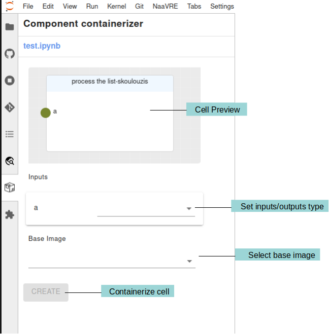
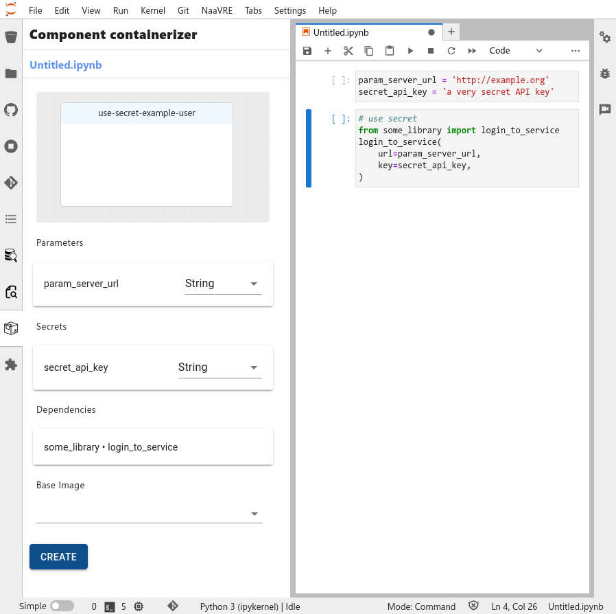
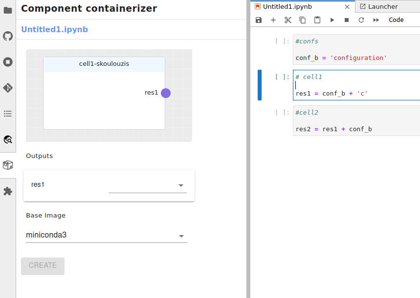
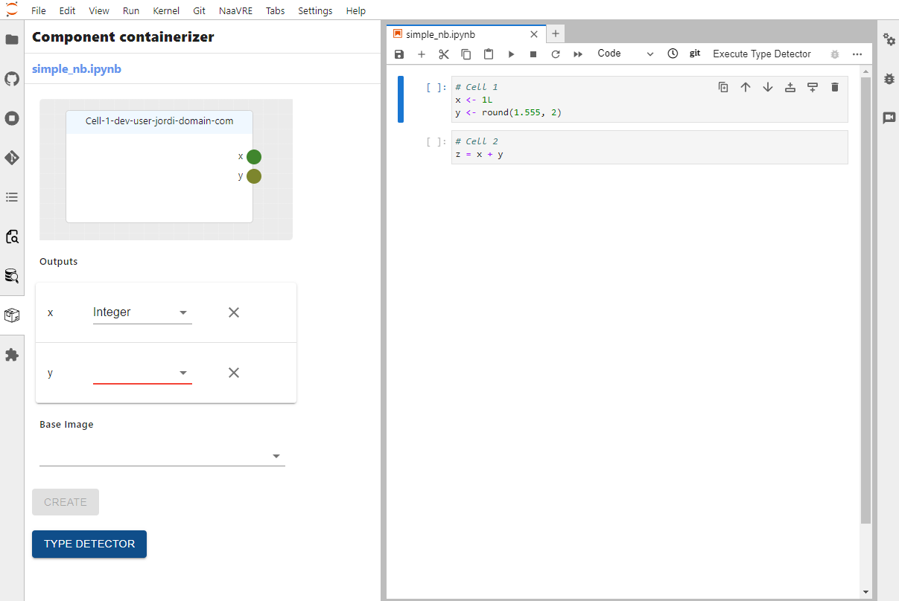
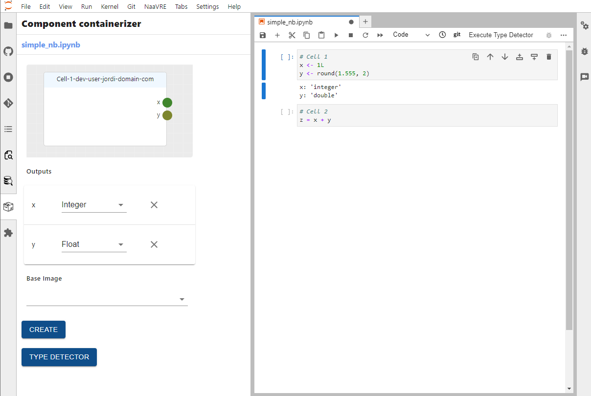

                              # Component Containerizer

The component containerizer enables you to turn Jupyter Notebook cells into workflow components.



The 'Cell Preview' panel shows a preview of the cell that is currently selected including its name, inputs and outputs.
Under the 'Cell Preview' panel there a list of the inputs and outputs of the cell and their types. The types are needed
to be filled in by the user when containerizing a cell. Currently, the supported types are:
* String
* Integer
* Float
* List

The maximum size for combined workflow component input is 65,000 characters. To process larger objects, store the data in a file and pass the filepath between components instead.

Under the 'Inputs' and 'Outputs' there is the 'Base Image' selection. This is the base image that will be used to build
the container. The default base image is 'miniconda3'. The user can select a different base image from the drop down.


### Special Variables

Special variables can be used in the cell code. Their name should contain one of the following prefixes:

* `param_`: these variables are used to pass input parameters to a cell. They should be used to allow users to set their own values when running a workflow. When containerizing the cell, a default value is extracted from the code and saved to the catalogue. When running a workflow that contains the cell, users use the default value or set a custom one. The value is then passed to the cell during execution.

  [Param_example.webm](https://github.com/QCDIS/vre_documetation/assets/9680609/fea3d96b-97d3-43cd-b009-b5bd4537de5a)

* `secret_`: these variables are used to pass secret parameters to a cell. They should be used for credentials such as passwords or API keys. They are similar to `param_` variables, but no default value is saved to the catalogue, and values are handled in a secure way when executing the workflow. In order not to accidentally commit secrets to the repository do not store them in the code. Instead, use the [SecretsProvider].

  

* `conf_`: these variables are used to pass configuration parameters to all cells. They are visible by all cells of the notebook. They can be thought of as 'global' variables therefore, they do not require to set their type  like other variables. Their value is set when containerizing the cell, and cannot be updated when running the workflow.

  [Conf_example.webm](https://github.com/QCDIS/vre_documetation/assets/9680609/f7020f7f-69d9-4916-bb56-83ed64cb98a8)

  

Notice in the image above that the `conf_b` variable is declared in the first cell and used in the second and third cell.
However, the `conf_b` is not showing up as input in the second and third cell.

### Overriding definition of cell inputs and outputs

:::warning
This feature can result in broken containerized cells. Use it with caution.
:::

In normal circumstances, the component containerizer automatically determines the cell variables (inputs, outputs,
params, confs) and dependencies by analyzing the source code.

This can be overridden by adding a special comment to the cell. The comment contains a YAML document, beginning with
`---` and ending with `...`.

Example:

```
# My cell name
# ---
# NaaVRE:
#  cell:
#   inputs:
#    - my_input: String
#    - my_other_input: Integer
#   outputs:
#    - my_output: List
#    - my_other_output: List
#   params:
#    - param_something:
#       type: String
#       default_value: "my default value"
#   confs:
#    - conf_something_else:
#       assignation: "conf_something_else = 'my other value'"
#   dependencies:
#    - name: yaml
#    - name: numpy
#      asname: np
#    - name: signal
#      module: scipy
# ...

(my cell code)
```

If an entry (e.g. `params:`) is omitted from the comment, the containerizer will try to determine the appropriate values from the source code.
This makes it possible to override some variable types, while using the code analysis for others.
In this example, the input and output are manually specified, while the dependencies, confs and params are determined from the source code (note how we specify that the cell has no outputs):

```
# My cell with partial override
# ---
# NaaVRE:
#  cell:
#   inputs:
#    - my_input: String
#   outputs: []
# ...

print(my_input, param_my_param)
```

For the full syntax, see the [YAML document schema](https://github.com/NaaVRE/NaaVRE-containerizer-service/blob/main/app/services/cell_extractor/cell_header.schema.json).

### Containerizing R cells

While containerizing R code cells is similar to Python, R's characteristics make it more challenging and require additional steps. The type of detected variables will only be identified if they have been explicitly assigned a primitive value.

```
# Will be detected
a <- 1L # Integer
b <- 1.5 # Float
c <- "foo" # String
d <- list(1,2,3) # List

# Will not be detected
e <- round(1.555, 2)
```

The type detector can detect the type of variables that have not been explicitly assigned a primitive value.



By pressing the `Type Detector` button, the selected cell will be executed by the kernel and the types of the detected variables will be retrieved. However, this does require that the selected cell is executable and that all used variables are initialized.



In R, new variables can be added to the environment without explicit initialization, leading to instances where additional inputs are detected. This is especially common when working with dataframes, where variables for columns may be implicitly created. Unwanted input variables can be removed by pressing the `X` button next to the variable.


