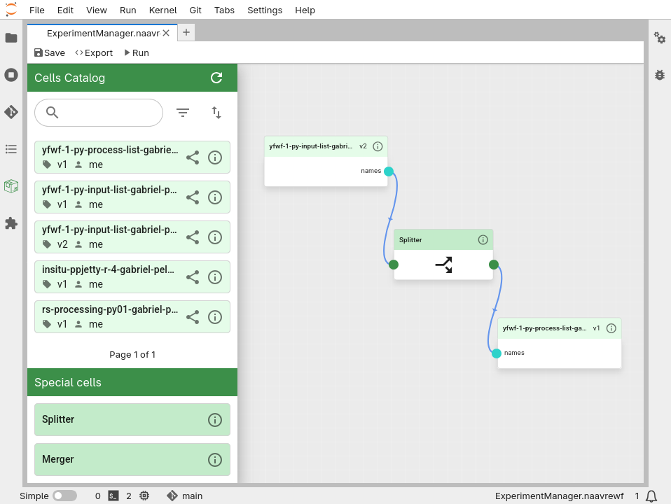
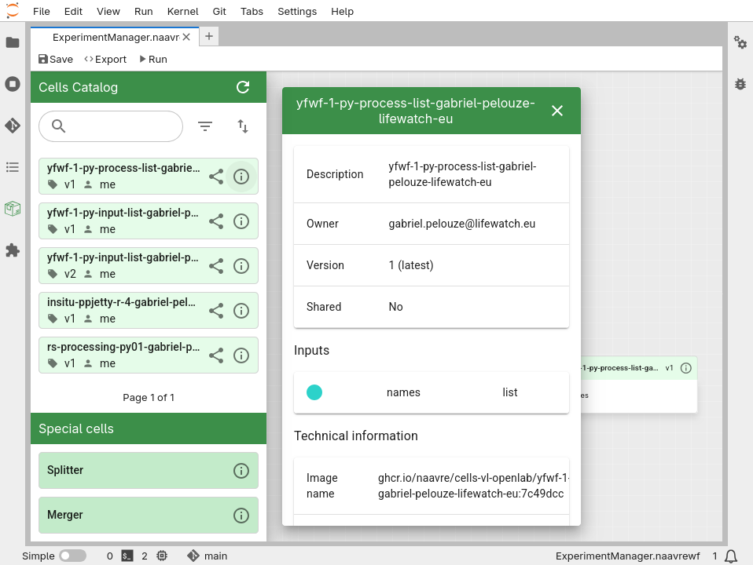
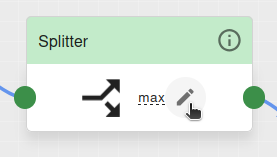
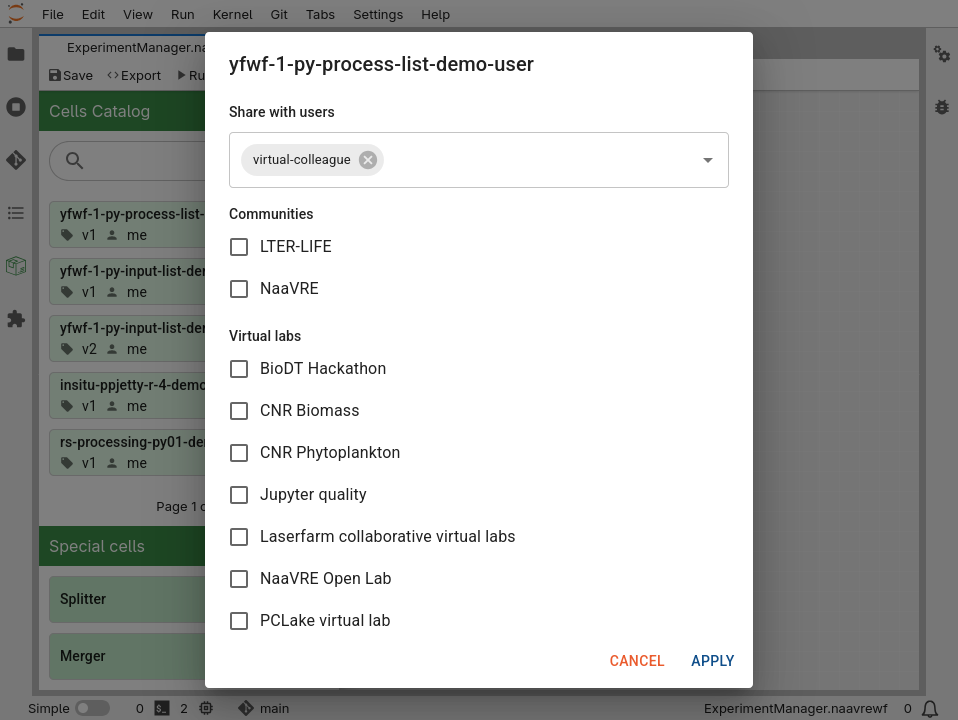
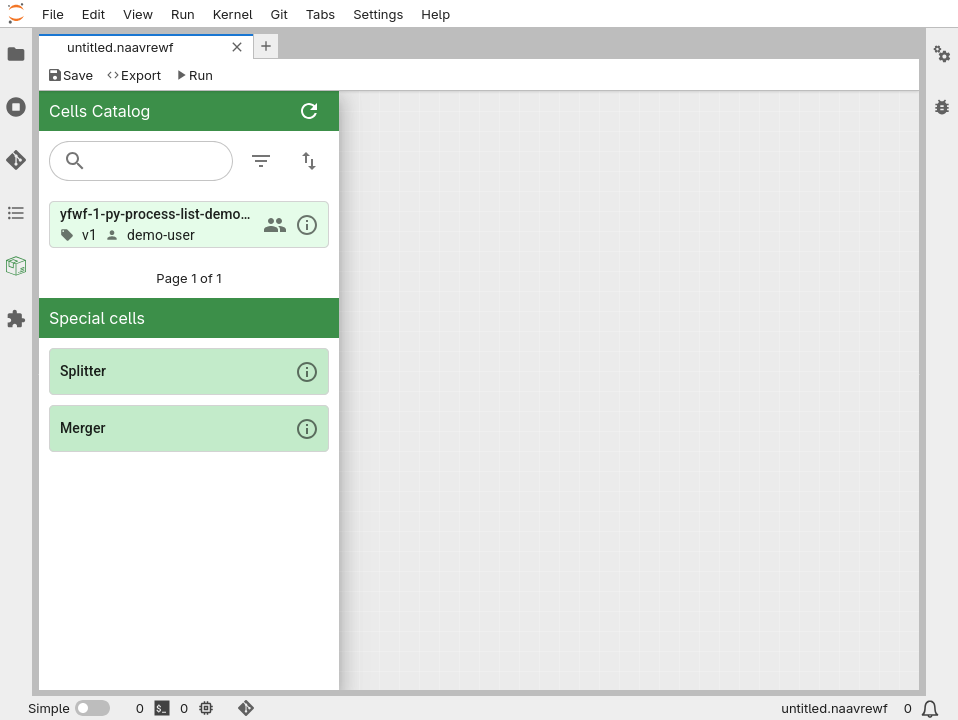
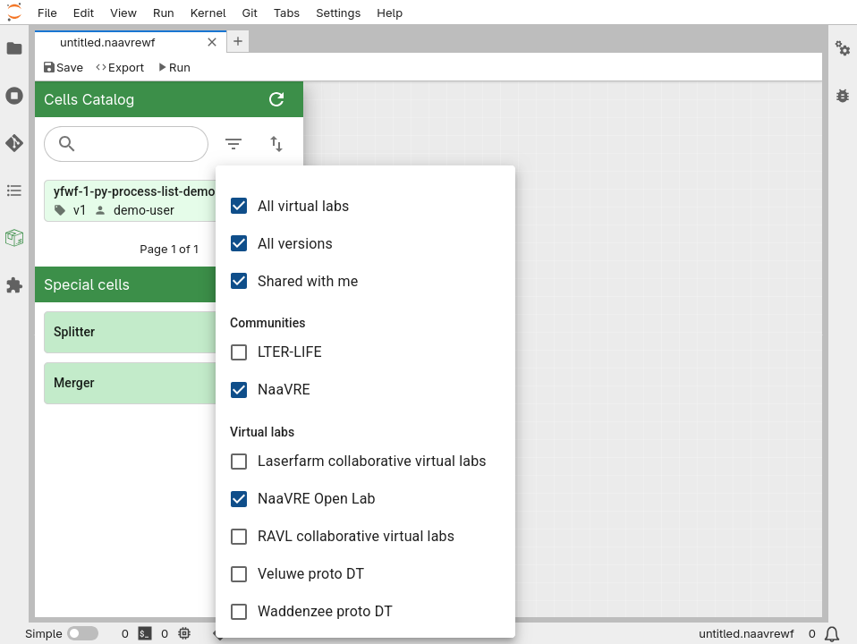
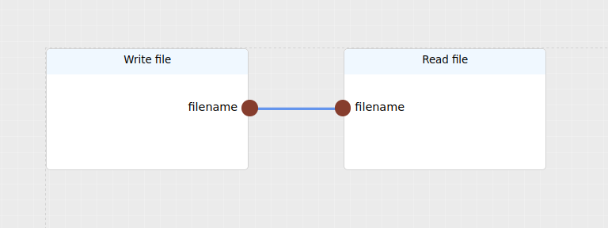

                              # Experiment Manager

import ShareIcon from '@mui/icons-material/Share';
import FilterListIcon from '@mui/icons-material/FilterList';
import PeopleIcon from '@mui/icons-material/People';

In the 'Experiment Manager' page you can compose and execute workflows.



### Cells Catalog
The cells catalog contains all the cells that have been containerized.



### Parallelization
To reduce workflow execution time, you can distribute tasks to multiple processors.
For this two special components are available:
* Splitter: This component is used to split an output array into batches and feed each batch to the
  next workflow component. That way the next component will be executed in parallel as many times as the number of batches.
  You can limit the number of branches created by the splitter by pressing the pencil icon on the splitter.

  

* Merger: This component is used to merge the outputs of the workflow component parallelized by the splitter into a single array.

You can practice using the splitter and merger in exercise 2 in the Open Lab.

### Sharing Cells

To share a cell, click on <ShareIcon style={{verticalAlign: "middle"}}/>. You can select users, communities or virtual labs:



Once a cell is shared, you can click on <PeopleIcon style={{verticalAlign: "middle"}}/> to update sharing permissions.

:::important
Cells shared with a community or virtual lab are visible everyone.
Please only share cells that are useful to others.
:::

Cells that are shared with you show up directly in your catalogue:



Cells shared within communities or virtual labs are only shown if they are relevant to the current virtual lab that you are running.
For instance, when running the “Open Lab”, only cells shared with the “NaaVRE” community and the “Open Lab” lab are shown by default.
To display cells from other communities or labs, click on the <FilterListIcon style={{verticalAlign: "middle"}}/>:



### Re-containerizing cells used in a workflow

When re-containerizing a cell used in a workflow, you might need to update the
workflow itself:


- If you only updated the cell's source code or dependencies: the workflow automatically uses the new version of the
  cell.
- If you changed the cell’s inputs, outputs or parameters: the workflow needs to be updated. Remove the cell from the
  workflow, and add the new version from the catalogue.
- If you changed the cell’s title: a new cell is created in the catalogue. Both the old and new cell can be used.
  Workflows using the old cell don’t need to be updated.

### Managing files in workflows

To transfer files between containerized cells when running the workflow, they need to be placed in the `/tmp/data/` repository. Files outside of this repository are not preserved from one containerized cell to the other.

The best practice for exchanging files between cells is to save the file in `/tmp/data/`, and pass the filename between the cells. Example:

```python
# Write file
filename = '/tmp/data/my_file.csv'
with open(filename, 'w') as f:
    f.write('file content')
```

```python
# Read file
with open(filename, 'r') as f:
    data = f.read()
```

