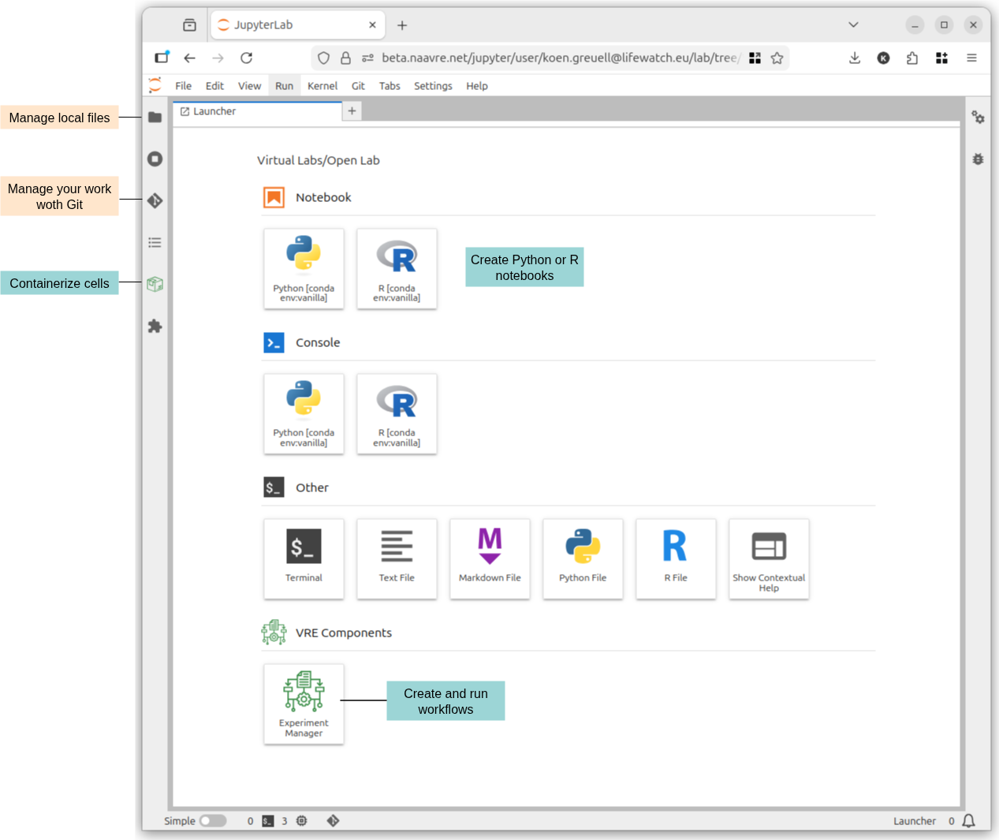
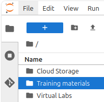

import SubpageTOC from '@site/src/components/SubpageTableOfContents';

# NaaVRE Documentation

The Notebook as a Virtual Research Environment (NaaVRE) is a set of tools to allow users to share code and workflows, containerize cells, compose
workflows and execute them on a workflow engine. Documentation is available for the following topics:

<SubpageTOC />

## Training materials
Besides the documentation on this website, training materials are available in the virtual labs.
[Click here](https://beta.naavre.net/jupyter/hub/user-redirect/lab/tree/Training%20materials/README.md?profile=openlab) to open the training materials in the Open Lab.

## Support
In case you keep being stuck on a problem, [get in touch with the NaaVRE development team](mailto:vlic@lifewatch.eu).