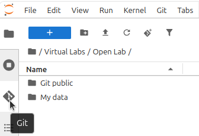

                              # Jupyterlab-git

The JupyterLab-Git extension allows you to use Git directly in your virtual lab environment.

### Folder structure
Each virtual lab contains two dedicated folders:
- My data (e.g., `Virtual Labs/Open Lab/My data`):
  - Use this folder to store your personal assets, including source code and workflows.
  - This is your workspace.
- Git public (e.g., `Virtual Labs/Open Lab/Git public`):
  - Contains public assets available to all users of the virtual lab.
  - Do not save files here, as they may be overwritten or lost.
  - If you want to modify files from Git public, copy them to `My data` first.

### Cloning a Git repository
To clone a Git repository into your virtual lab:
1. Navigate to the `My data` folder in JupyterLab.
2. Open the Git extension.



3. Click `Clone a repository`.

### Pushing changes to a git repository
If you have write access to the repository, you can push changes using a fine-grained GitHub personal access token:
1. Generate a token in GitHub:
   1. Go to GitHub personal access tokens.
   2. Create a [fine-grained token](https://github.com/settings/personal-access-tokens) with the following minimum permissions for the repository:
      1. Read access to metadata
      2. Read and write access to code
2. Use this token to authenticate when pushing changes from JupyterLab-Git.

### Recommended .gitignore
To avoid committing unnecessary or sensitive files, use a `.gitignore` file in your repository. We recommend including at least the following:
```gitignore
# Jupyter notebook checkpoints
.ipynb_checkpoints

# Environment variables (contains secrets)
.env
```
The .env file is used by SecretsProvider to store secrets and must not be committed to the repository.