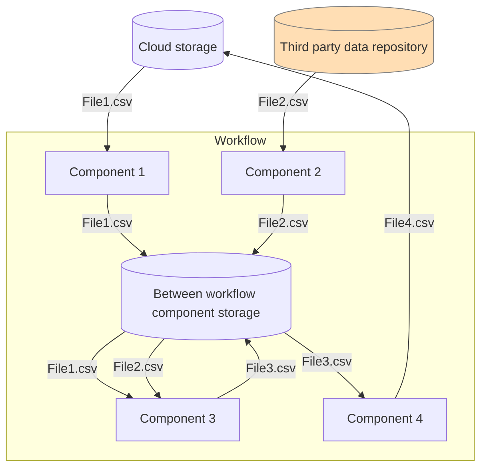
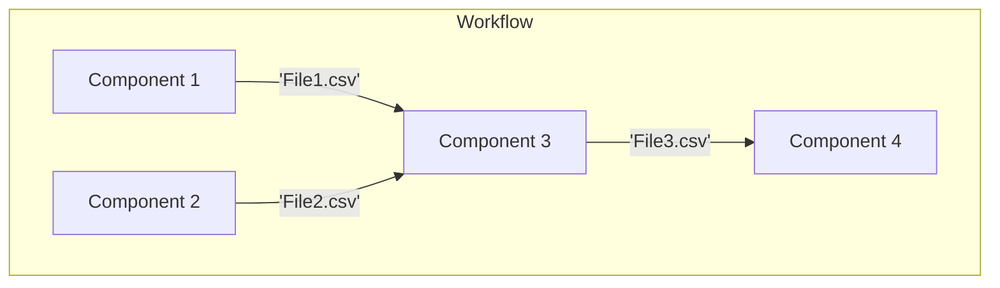

                              # Reading and Writing Files in NaaVRE

NaaVRE provides three ways to store data. Choosing the right storage is a trade-off between data lifetime and access speed.

Storage Type            |	Suitable For...	| Lifetime |	Speed
------------------------|----------------|----------|--------------
Within workflow component storage |	Files used in one Jupyter notebook cell / workflow component.	| Kept during the execution of the component. |	Fastest
Between workflow component storage | Passing data between workflow components. |	Kept during the workflow run. |	Fast
Cloud storage           |	Saving workflow output.	| Persistent.	| Slower

### Within workflow component storage {#Within-workflow-component-storage}
This storage is for intermediate files created and used within a single workflow component.
If you use the NaaVRE containerizer to turn a Jupyter cell into a component, files written to the current directory (e.g., `./temp.csv`) are private to that step.
They are not accessible to other components and will be deleted once the step finishes.

:::note
Keeping data in a variable (in RAM) is always faster than writing to disk. Only write to a file when using it in the same Jupyter cell if your specific tool requires a file path as input.
:::

### Between workflow component storage {#Between-workflow-component-storage}
This storage is meant to pass files between components in a workflow. NaaVRE clears this storage automatically once the workflow finishes.
Use this for large intermediate datasets that you don't need to keep once the workflow finishes, as it is faster than cloud storage.
- Path: `/tmp/data/your_file.csv`
- Guide: [The NaaVRE Interface - Managing files in workflows](../../NaaVRE_documentation/experiment-manager/#managing-files-in-workflows)

### Cloud storage - Workflow output storage {#Cloud-storage}
Use this storage for workflow output, logs, and metadata you want to access after the workflow is done.
NaaVRE provides integrated S3-compatible object storage, which has limited capacity and does not create back-ups.
You can also provide and integrate with your own external cloud storage.

#### Integrated Cloud Storage (small/medium files)
Use the following built-in folders in your file explorer for metadata and small result sets:
- /home/jovyan/Cloud Storage/naa-vre-user-data (Read/Write): Your personal "Cloud Drive."
- /home/jovyan/Cloud Storage/naa-vre-public (Read-Only): You can not write files to this folder, only read from it.
It is meant for input datasets and configuration files that all users should be able to use in their workflows.


Python example:
```python
import pandas as pd
dataframe = pd.DataFrame()
dataframe.to_csv("/home/jovyan/Cloud Storage/naa-vre-user-data/dummy_results.csv", index=False)
```

R example:
```R
write.csv(data.frame(), file = "/home/jovyan/Cloud Storage/naa-vre-user-data/dummy_results.csv")
```

#### External Cloud Storage (large datasets)
For "Big Data" (i.e. multiple gigabytes), do not use the integrated folders. Instead, connect directly to external providers.

For example, to read a file from MinIO/S3, in Python you can use the following code:

```python
# Configuration (do not containerize this cell)
param_minio_endpoint = "MINIO_ENDPOINT"  # Replace with your MinIO endpoint, e.g., "myhost:9000". The MinIO endpoint for hot storage provided by VLIC is available on request.
param_minio_user_prefix = "myname@gmail.com"  # Your personal folder in the naa-vre-user-data bucket in MinIO
secret_minio_access_key = "MINIO_ACCESSKEY"  # Replace with your actual MinIO access key
secret_minio_secret_key = "MINIO_SECRETKEY"  # Replace with your actual MinIO secret key

# Access MinIO files
from minio import Minio
mc = Minio(endpoint=param_minio_endpoint,
           access_key=secret_minio_access_key,
           secret_key=secret_minio_secret_key)

# List existing buckets: get a list of all available buckets
mc.list_buckets()


# Download file from bucket: download `myfile.csv` from your personal folder on MinIO and save it locally as `myfile_downloaded.csv`
mc.fget_object(bucket_name="bucket", object_name=f"{param_minio_user_prefix}/myfile.csv", file_path="myfile_downloaded.csv")

# Process file
# For example, read the CSV file using pandas

# Upload file to bucket: uploads `myfile_local.csv` to your personal folder on MinIO as `myfile.csv`
mc.fput_object(bucket_name="bucket", file_path="myfile_local.csv", object_name=f"{param_minio_user_prefix}/myfile.csv")

```

Similarly, in R you can use the following code:

```R
# Configuration (do not containerize this cell)
param_minio_endpoint = "MINIO_ENDPOINT"  # Replace with your MinIO endpoint, e.g., "myhost:9000". The MinIO endpoint for hot storage provided by VLIC is available on request.
param_minio_region  = "nl-uvalight"
param_minio_user_prefix  = "myname@gmail.com"
secret_minio_access_key   = "MINIO_ACCESSKEY"
secret_minio_secret_key   = "MINIO_SECRETKEY"

# Access MinIO files
install.packages("aws.s3")
library("aws.s3")

Sys.setenv(
  "AWS_S3_ENDPOINT"  = param_minio_endpoint,
  "AWS_DEFAULT_REGION" = param_minio_region,
  "AWS_ACCESS_KEY_ID" = secret_minio_access_key,
  "AWS_SECRET_ACCESS_KEY" = secret_minio_secret_key
)

# List existing buckets
bucketlist()

# Download file from MinIO
save_object(
  bucket = "bucket",
  object = paste0(param_minio_user_prefix, "/myfile.csv"),
  file = "myfile_downloaded.csv"
)

# Process file
# For example, read the CSV file using readr


# Upload file to MinIO
put_object(
  bucket = "bucket",
  file = "myfile_local.csv",
  object = paste0(param_minio_user_prefix, "/myfile.csv")
)

```

### Passing files in a workflow
In a NaaVRE workflow, variables are temporary, as they exist only for the duration of the workflow execution.
Additionally, there is a size limit: objects passed between workflow components cannot exceed 65,000 characters.
To make data persistent and handle larger datasets, workflows typically:
- Store files in the final components of the workflow.
- Pass files between components to share data.
The flowchart below illustrates how files are passed in an example workflow.
<br />
In the example, two data sources are used: [Cloud storage](#Cloud-storage) and a third party data repository.
- Workflow component 1: Retrieves File1.csv from cloud storage and stores File1.csv to [between workflow component storage](#Between-workflow-component-storage).
- Workflow component 2: Retrieves File2.csv from a third party data repository and stores File2.csv to between workflow component storage.
- Workflow component 3: Reads File1.csv and File2.csv from between workflow component storage and stores its output (File3.csv) there.
- Workflow component 4: Reads File3.csv from between workflow component storage and stores its output (File4.csv) to cloud storage.

After finishing the workflow, only File4.csv will remain.
Additionally if the size of the data within a workflow component is too large for the working memory of the workflow component
[within workflow component storage](#Within-workflow-component-storage) can be used.

To handle the passing of the files in the previous example, the following output-input is exchanged between the workflow components:

Additionally, the following parameters are defined to create the filepaths:
```
# Parameters
param_input1_filename = 'File1.csv'
param_input2_filename = 'File2.csv'
param_output_filename = 'File4.csv'
param_workflow_folder = '/tmp/data'
param_cloud_storage_folder = '/home/jovyan/Cloud Storage/naa-vre-user-data/'
```
In the example, workflow component 4 gets the filepath `{param_workflow_folder}/{file3}`.
The variable `file3` with value `File3.csv` is passed as output-input from workflow component 3.