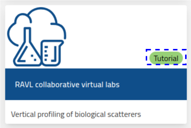

Virtual labs at higher readiness levels include a tutorial, enabling users work to onboard to the lab independently.
You can identify these labs by the "Tutorial" label on the [NaaVRE home page](https://beta.naavre.net/vreapp):

If you are new to NaaVRE, we recommend that you start with the [NaaVRE tutorial](./../tutorials) before doing a tutorial for a specific virtual lab.