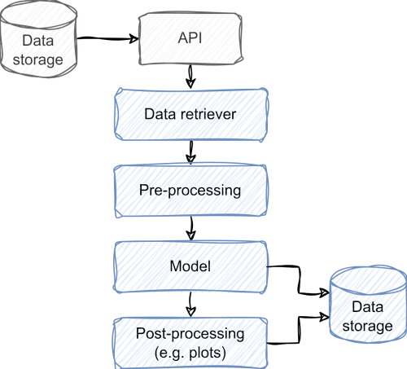

A development plan aims to create an overview of the concept for the virtual lab and the steps needed to implement it.
The development plan ensures the needed human and computational resources become available.
A development plan contains the following:

- The scientific objective
- The scientific question
- A description of the methods including data sources and models.
- A flowchart of the components, including data sources, APIs, data retrieval, pre-processing, model, post-processing, data storage and visualization.
  - What kind of data is passed on between the components?
- An indication of the development effort and necessary resources.
  - This may include the development of new features of NaaVRE.
  - How much data will be used?
  - What are the computational requirements?

 
*Figure 1: Sketch of a flowchart of components.*