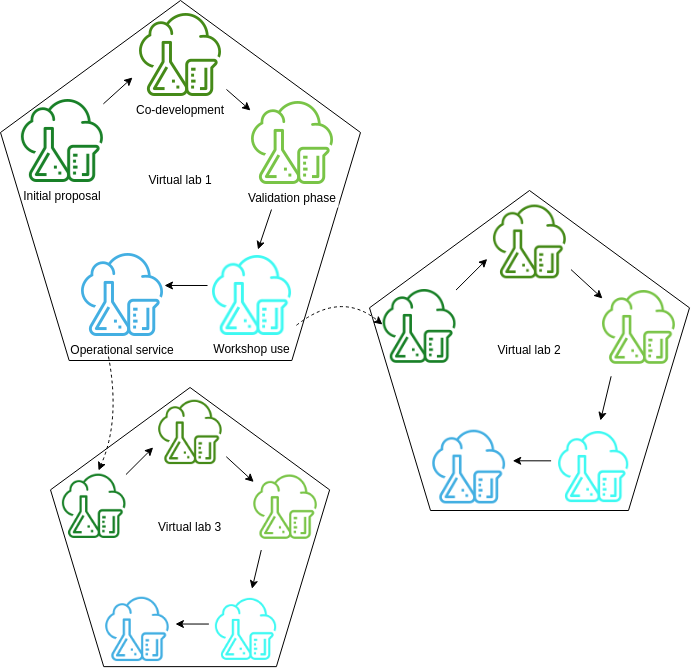
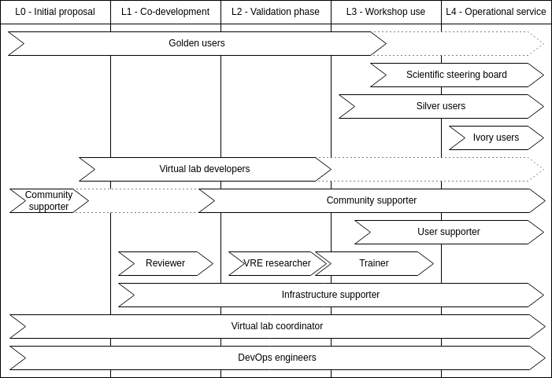

import LinkButton from '@site/src/components/LinkButton';

<LinkButton
  to="https://docs.google.com/forms/d/e/1FAIpQLSdbF6lrAYUx2CH7oxpjKWAa3mH2bSIPKJB5BkRa3xZStTcJOg/viewform?usp=dialog"
  label="Plan your own virtual lab"
/>
 

The NaaVRE platform facilitates data- and computing-centric research activities by enabling scientists to create customizable virtual labs for specific scientific purposes.
This is achieved through a collaborative co-development approach, bringing together domain specialists, computational scientists, data scientists, and development and operations engineers.

A maturity level framework[^1] assists researchers in virtual lab co-development by:
* Introducing the potential content of virtual labs.
* Defining stakeholder roles.
* Describing the progression of a virtual lab through maturity levels,
highlighting requirements, milestones and responsibilities.

## Content of a virtual lab
To successfully develop a reusable and maintainable virtual lab, it is important to understand what a virtual lab is made up of.
A NaaVRE virtual lab provides a collection of research tools and assets customized for a specific research need:

* Assets created in the virtual lab.
* Documents that support the usability of the virtual lab.

### Assets
Three types of assets can be created in a virtual lab:

* The codebase: Any code written for the virtual lab. The codebase interacts with external resources such as software libraries and external data.
* Internal data: Produced in the virtual lab by data processing, data analysis, and simulations.
* Workflows and workflow components (created by containerizing cells from the notebooks in the codebase).

### Documents
Besides assets, we encourage the developers of a virtual lab to create documents that aid the FAIRness and maintenance of the virtual lab:
* Metadata.
* Documentation, including a tutorial.

## Stakeholder roles
NaaVRE aims to be a virtual research environment (VRE) that enables experts in computational ecology and ecological data analysis
to create virtual labs.
Stakeholders are organized into multiple roles to facilitate the collaboration that enables innovative research methods. Some people will only have
one role for the virtual lab, while others might have multiple of the following roles:

* **Domain researchers and public users:** Roles for domain scientists conducting research in virtual labs and anyone using the virtual lab developed by a domain researcher.
  * [Golden user](Virtual_lab_roles/Golden_user): Provides a scientific scenario that will be studied in NaaVRE. Steers the development of a
  new virtual lab with domain knowledge and scientific direction. Conducts the first research in that virtual lab.
  * **Silver user:** Onboards to an existing virtual lab through a workshop, training or hackathon. Starts using the virtual lab for their own scientific scenarios after onboarding.
  * **Ivory user:** Other users that visit or use the virtual lab once it becomes publicly available.
* **Virtual lab development roles:** Roles involved in the development of a new virtual lab.
  * [Virtual lab developer](Virtual_lab_roles/Virtual_lab_developer): Develops the source code and components in a virtual lab in NaaVRE.
  * [Virtual lab code reviewer](Virtual_lab_roles/Reviewer): Provide feedback during co-development on the user-friendliness, maintainability, and robustness of the
  source code and other assets.
* **Virtual lab support roles:** Roles to support development and use of virtual labs.
  * [Scientific steering board](Virtual_lab_roles/Steering_board): Coordinates the development of the virtual lab with a scientific vision.
  * [Community supporter](Virtual_lab_roles/Community_supporter): Forms connections between users and the virtual lab.
  * [Virtual lab trainer](Virtual_lab_roles/Trainer): Knows the lab from a user viewpoint and provides trainings to new users.
  * [Virtual lab coordinator](Virtual_lab_roles/Coordinator): Knows the lab from a technical perspective and pushes the lab to the next maturity level if there is a user community. Often, this will be an employee at LifeWatch ERIC VLIC
  * [Virtual research environment development and operations (VRE DevOps) engineer](Virtual_lab_roles/DevOps): Maintains NaaVRE. Often, this will be an employee at LifeWatch ERIC VLIC.
  * [VRE networked systems researcher](Virtual_lab_roles/VRE_researcher): Contributes a prototype of a state-of-the-art component to the virtual research environment and can publish technical papers
  that demonstrate the relevance of NaaVRE in the field of networked systems.
  * [User supporter](Virtual_lab_roles/User_supporter): Can support users. Knows the potential and limitations of the lab and can help out when problems arise.
  * [Infrastructure supporter](Virtual_lab_roles/Infrastructure_supporter): Ensures there is infrastructure that allows the virtual lab to be used by multiple users.
  * **Infrastructure provider:** Organisation that provides infrastructure for the virtual lab.

## Maturity levels
We discern five maturity levels in the development of a virtual lab.
Virtual labs evolve through these maturity levels by improving and expanding the assets and documents of the virtual lab.
Higher maturity levels increase the usability of the lab for others, reducing reliance on virtual lab developers and the VRE DevOps team.

* [L0 Initial proposal](L0_initial_proposal): The initial proposal of a virtual lab, with conceptual definition but no technical setup.
* [L1 Co-development](L1_co-development): A provisioned virtual lab that is ready for the virtual lab development team to implement the virtual lab functionality, e.g. new components, workflows, or experiments.
* [L2 Validation phase](L2_validation_phase): A provisioned virtual lab with developed components. It is ready to run scientific experiments to validate the virtual lab and write scientific publications.
* [L3 Workshop use](L3_workshop_use): A provisioned virtual lab with validated components and scientific stories. It is ready to engage more users through training and hackathons under controlled conditions.
* [L4 Operational service](L4_operational_service): A provisioned virtual lab on operational infrastructure. It is ready to be operational for serving users from the general public.

| Level | Name                | Duration    | Developers                  | Users | Context dissemination            | Entering condition                                                     | Exit condition                                                                     |
|-------|---------------------|-------------|-----------------------------|-------|----------------------------------|------------------------------------------------------------------------|------------------------------------------------------------------------------------|
| L0    | initial proposal    | 1-12 months | 0                           | 0     |                                  | A good idea & Available resources.                                     | Set up a concrete lab on the platform.                                             |
| L1    | Co-development      | 3-6 months  | Virtual lab developers 6-12 FTE    | 0     | Metadata publication             | A virtual lab & a virtual lab development team.                                       | A lab ready for scientific experiments.                                            |
| L2    | Validation phase    | 3 months    | A team of virtual lab developers   | 1     | Paper publication                | A lab ready for writing a scientific paper.                            | One or two papers submitted to publication.                                        |
| L3    | Workshop use        | 3 months    | virtual lab developers or users    | 10-25 | Workshops, trainings, hackathons | A working lab with documentation and training material.                | The lab has been tested in workshops / hackathons, and has an emerging  community. |
| L4    | Operational service |             | Virtual lab developers or users    | 10+   |                                  | The lab is operational, and can be managed on research infrastructure. |                                                                                    |

*Table 1: Summary of maturity levels, with duration, number of developers and users,
how the context of the lab is communicated with the outside world, and what conditions per transition should be met.*

 
*Figure 1: The virtual lab moves through the maturity levels, from initial proposal to operational service.
Users coming up with ideas for new experiments that can not be done in the existing virtual labs,
can, in collaboration with LifeWatch, create a new virtual lab that fits their needs.*

 
*Figure 2: Timeline per maturity level showing the timing of role involvement. See roles pages for details.*

## Sources
* These recommendations are partially based on ideas presented in the paper [Introducing the FAIR Principles for research software](https://www.nature.com/articles/s41597-022-01710-x), the [Fair software checklist](https://fairsoftwarechecklist.net/v0.2/), and [fair-software.eu](https://fair-software.eu/recommendations/license).

## Potential ToDos for LifeWatch VLIC
To be able to cycle through the entire maturity cycle described here, LifeWatch VLIC needs to provide the following:

* Make NaaVRE generate a persistent identifier and version number for containerized cells and executed workflows. https://github.com/QCDIS/projects_overview/issues/280
* Choose a metadata standard for Virtual labs.  https://github.com/QCDIS/projects_overview/issues/275
* Create recommendations on community standards for reading, writing and exchanging data in virtual labs. See github issue [#281](https://github.com/QCDIS/projects_overview/issues/281)
* Create recommendations for testing: https://github.com/QCDIS/projects_overview/issues/274
* Determine a way of structuring files in a virtual lab git repository that allows publication of the user manual and documentation on NaaVRE.net.  https://github.com/QCDIS/projects_overview/issues/279

### Publications
[^1]: Z. Zhao, W. D. Kissling, G. M. Hengeveld, I. Athanasiadis, K. Soetaert and A. Hof, "A Virtual Lab Maturity Model for Guiding the Co-Development of Advanced Virtual Research Environments," 2025 IEEE International Conference on Service-Oriented System Engineering (SOSE), Tucson, AZ, USA, 2025, pp. 20-26, doi: [10.1109/SOSE67019.2025.00007](https://doi.org/10.1109/SOSE67019.2025.00007).