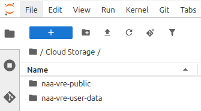

                              # Reading and Writing Files in NaaVRE

There are four options available for reading and writing files in NaaVRE which all come with their own performance and availability trade-offs:
1) Write and read data within a single workflow component / Jupyter lab cell:
If you need to store data as a file which you will only use within the same workflow component, you can store the data in the directory of the Jupyter notebook.
Keeping objects in memory will mostly be faster then writing to a file, but if you must write to a file and read it again,
this will be the fastest option.
2) Write data in a workflow component and use it in another workflow component:
If you want to use data in a different workflow component within the same workflow,
you should store the data in `/tmp/data` (see [The NaaVRE Interface - Managing files in workflows](../../NaaVRE_Interface/#managing-files-in-workflows)).
`/tmp/data` stores files for the duration of the workflow, so it can not be used to store results of the workflow for later use.
This option is slightly slower than option 1.
3) Workflow output data - cloud storage: To write files in NaaVRE that are kept when the workflow finishes, use cloud storage.
The Jupyter notebook file system and the file system used by cells during the workflow execution are not the same
and files stored in the workflow are discarded at the end of the workflow.
Writing and reading files from cloud storage is slower than option 1 and 2.

### Workflow output data - cloud storage
You can store data in the Virtual Lab using two primary methods: Integrated Cloud Storage (for temporary metadata) and External Cloud Storage (for large datasets).

#### Integrated Cloud Storage


While developing a prototype of your workflow or when you want to store metadata about your runs, you can use the cloud storage that is built into NaaVRE. This storage is accessible directly through folders in the File Explorer:
- /home/jovyan/Cloud Storage/naa-vre-public (Read-Only): Contains public data for virtual labs. You can read from it, but you cannot save or modify files here.
- /home/jovyan/Cloud Storage/naa-vre-user-data (Read/Write): This is for storing your personal data. You have write permissions for this folder, allowing you to save data, scripts,
and results directly from your Jupyter Notebooks and workflows as if it were a local drive.

To write data to your personal cloud storage, see the following example in Python:
```python
import pandas as pd
dataframe = pd.DataFrame()
dataframe.to_csv("/home/jovyan/Cloud Storage/naa-vre-user-data/dummy_results.csv", index=False)
```

To write a file to your user folder in R, see the following example:
```
write.csv(data.frame(), file = /home/jovyan/Cloud Storage/naa-vre-user-data/dummy_results.csv")
```

#### External cloud storage

To read or write large files in NaaVRE, you should first upload it to an external storage.
Then you should write the relevant code in the Jupyter notebook to read the file
process it and write the results back to the external storage.
For example to read a file from MinIO/S3, in Python you can use the following code:

```python
# Configuration (do not containerize this cell)
param_minio_endpoint = "MINIO_ENDPOINT"  # Replace with your MinIO endpoint, e.g., "myhost:9000". The MinIO endpoint for hot storage provided by VLIC is available on request.
param_minio_user_prefix = "myname@gmail.com"  # Your personal folder in the naa-vre-user-data bucket in MinIO
secret_minio_access_key = "MINIO_ACCESSKEY"  # Replace with your actual MinIO access key
secret_minio_secret_key = "MINIO_SECRETKEY"  # Replace with your actual MinIO secret key

# Access MinIO files
from minio import Minio
mc = Minio(endpoint=param_minio_endpoint,
           access_key=secret_minio_access_key,
           secret_key=secret_minio_secret_key)

# List existing buckets: get a list of all available buckets
mc.list_buckets()


# Download file from bucket: download `myfile.csv` from your personal folder on MinIO and save it locally as `myfile_downloaded.csv`
mc.fget_object(bucket_name="bucket", object_name=f"{param_minio_user_prefix}/myfile.csv", file_path="myfile_downloaded.csv")

# Process file
# For example, read the CSV file using pandas

# Upload file to bucket: uploads `myfile_local.csv` to your personal folder on MinIO as `myfile.csv`
mc.fput_object(bucket_name="bucket", file_path="myfile_local.csv", object_name=f"{param_minio_user_prefix}/myfile.csv")

```

Similarly, in R you can use the following code:

```R
# Configuration (do not containerize this cell)
param_minio_endpoint = "MINIO_ENDPOINT"  # Replace with your MinIO endpoint, e.g., "myhost:9000". The MinIO endpoint for hot storage provided by VLIC is available on request.
param_minio_region  = "nl-uvalight"
param_minio_user_prefix  = "myname@gmail.com"
secret_minio_access_key   = "MINIO_ACCESSKEY"
secret_minio_secret_key   = "MINIO_SECRETKEY"

# Access MinIO files
install.packages("aws.s3")
library("aws.s3")

Sys.setenv(
  "AWS_S3_ENDPOINT"  = param_minio_endpoint,
  "AWS_DEFAULT_REGION" = param_minio_region,
  "AWS_ACCESS_KEY_ID" = secret_minio_access_key,
  "AWS_SECRET_ACCESS_KEY" = secret_minio_secret_key
)

# List existing buckets
bucketlist()

# Download file from MinIO
save_object(
  bucket = "bucket",
  object = paste0(param_minio_user_prefix, "/myfile.csv"),
  file = "myfile_downloaded.csv"
)

# Process file
# For example, read the CSV file using readr


# Upload file to MinIO
put_object(
  bucket = "bucket",
  file = "myfile_local.csv",
  object = paste0(param_minio_user_prefix, "/myfile.csv")
)

```
